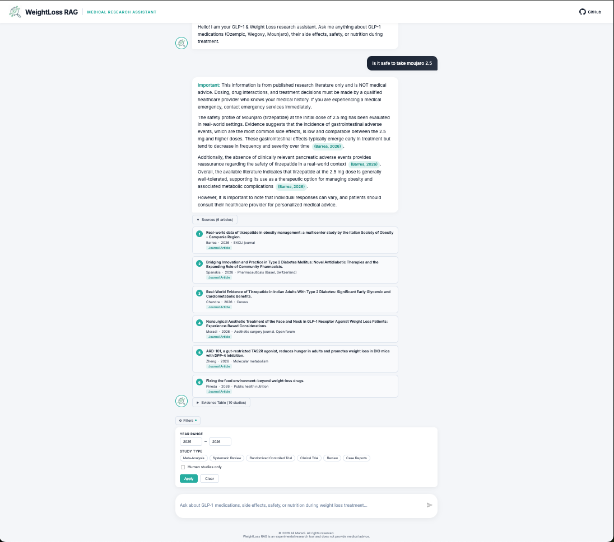

# WeightLoss RAG — Citation-Faithful Biomedical Research Assistant

A conversational RAG (Retrieval-Augmented Generation) system for searching, analysing, and synthesising PubMed literature on GLP-1 medications and weight loss. Ask questions about semaglutide, tirzepatide, Ozempic, Wegovy, Mounjaro, side effects, safety, and nutrition — and get evidence-backed answers with inline citations linked directly to PubMed.



## Key Features

- **Claim-level citations** — every medical claim links to its PubMed source via `(Author, Year) [PMID: XXXXXX]`
- **Source inspector** — collapsible panel showing all retrieved documents with metadata and relevance scores
- **PICO evidence tables** — auto-generated study summary tables (Population, Intervention, Comparator, Outcome)
- **Structured generation** — answers decomposed into typed claims (evidence / inference / background) with per-claim confidence
- **Claim verification** — each claim classified as supported, partial, unsupported, or contradictory against source text
- **Safety guardrails** — keyword-based risk classification (low / moderate / high) with disclaimers for dosage, drug interaction, and emergency queries
- **Uncertainty handling** — conflict detection, calibrated hedging language, and literature gap identification
- **Search filters** — year range, publication type, and human-only toggles exposed in the UI
- **4-stage hybrid retrieval** — dense + sparse search with publication type, section, and recency reranking
- **Streaming SSE** — token-by-token response streaming with real-time status updates
- **Evaluation framework** — LLM-as-a-judge scoring with per-dimension metrics and trend tracking

---

## Architecture

```
                              User Query
                                  │
                      ┌───────────▼───────────┐
                      │    React Frontend      │
                      │  (Vite + MUI + SCSS)   │
                      └───────────┬───────────┘
                                  │ SSE stream (POST /api/chat)
                      ┌───────────▼───────────┐
                      │     FastAPI Backend    │
                      │                        │
                      │  ┌──────────────────┐  │
                      │  │  SafetyClassifier │──┼──► Safety disclaimer (if high/moderate risk)
                      │  └──────────────────┘  │
                      │  ┌──────────────────┐  │
                      │  │   ChatEngine      │  │
                      │  │  (session memory  │  │
                      │  │   + query reform) │  │
                      │  └────────┬─────────┘  │
                      │           │             │
                      │  ┌────────▼─────────┐  │
                      │  │    QA Chain       │  │
                      │  │                   │  │
                      │  │  ┌─────────────┐  │  │
                      │  │  │  Retriever   │  │  │     ┌──────────────────┐
                      │  │  │  (4-stage)   │──┼──┼────►│  Qdrant Cloud    │
                      │  │  └─────────────┘  │  │     │  Index A: abstracts
                      │  │                   │  │     │  Index B: body chunks
                      │  │  ┌─────────────┐  │  │     │  Dense + BM25 sparse
                      │  │  │ gpt-4o-mini │  │  │     └──────────────────┘
                      │  │  │ (T=0.1)     │  │  │
                      │  │  └─────────────┘  │  │
                      │  │                   │  │
                      │  │  ┌─────────────┐  │  │
                      │  │  │  Evidence    │  │  │
                      │  │  │  Table Gen  │  │  │
                      │  │  └─────────────┘  │  │
                      │  └───────────────────┘  │
                      └─────────────────────────┘
                                  │
                   SSE events: status → tokens → sources → evidence_table
```

### Data Pipeline

```
PubMed (NCBI Entrez API)
      │
      ▼
  [1] Ingestion              scripts/batch_ingest_weightloss.py
      5,000 papers        →  data/raw/weightloss/ (one JSON per PMID)
      │
      ▼
  [2] Chunking               scripts/run_chunking.py
      Index A: abstracts  →  data/processed/weightloss/
      Index B: body chunks    (markdown header split + recursive char split)
      │
      ▼
  [3] Embedding              scripts/embed_to_qdrant.py
      Dense: OpenAI text-embedding-3-small (1536-dim, cosine)
      Sparse: FastEmbedSparse BM25
      │
      ▼
  [4] Qdrant Cloud           2 collections, hybrid retrieval mode
```

### Retrieval Pipeline (4 Stages)

| Stage | Name | Logic |
|---|---|---|
| 1 | Abstract Discovery | Hybrid search on Index A → top 50 candidate PMIDs |
| 2 | Deep Chunk Search | Hybrid search on Index B, scoped to candidate PMIDs → 80 chunks |
| 3 | Reranking | Additive boosts: Meta-Analysis +1.0, RCT +0.85, Results section +1.5, recency decay |
| 4 | Diversity Filter | Max 5 chunks per article, return top 30 |

**Fallback:** If Stage 1 finds no candidates or the LLM reports insufficient evidence, a global Index B search is triggered.

### SSE Event Flow

```
Client ◄── {"type": "safety",         "disclaimer": "..."}     (if moderate/high risk)
       ◄── {"type": "status",         "message": "Scanning PubMed abstracts..."}
       ◄── {"type": "status",         "message": "Retrieving the relevant articles..."}
       ◄── {"type": "status",         "message": "Synthesizing clinical evidence..."}
       ◄── {"type": "token",          "content": "Semaglutide..."}   (streamed tokens)
       ◄── {"type": "sources",        "docs": [...]}                 (retrieved articles metadata)
       ◄── {"type": "evidence_table", "rows": [...]}                 (PICO table)
```

---

## Tech Stack

| Layer | Technology |
|---|---|
| **Frontend** | React 19, TypeScript, Vite, MUI v7, SCSS |
| **Backend** | Python 3.12, FastAPI, Uvicorn |
| **LLM** | OpenAI `gpt-4o-mini` (T=0.1 for answers, T=0.0 for parsing/verification) |
| **Embeddings** | OpenAI `text-embedding-3-small` (dense, 1536-dim), FastEmbedSparse BM25 (sparse) |
| **Vector DB** | Qdrant Cloud (2 collections, hybrid mode) |
| **Orchestration** | LangChain Core + LangChain OpenAI |
| **Data source** | PubMed / NCBI Entrez API (~5,000 papers ingested) |
| **Tracing** | LangSmith (optional) |
| **Hosting** | Firebase Hosting (frontend), Docker (backend) |
| **Tests** | pytest (76 tests) |

---

## Cost and Latency

Typical per-query costs and latencies (measured with `gpt-4o-mini`, March 2026):

| Operation | Tokens (approx) | Cost (approx) | Latency |
|---|---|---|---|
| Query parsing | ~300 in, ~100 out | $0.0001 | ~0.5s |
| Qdrant retrieval (2 stages) | — | — | ~0.8s |
| Answer generation | ~4,000 in, ~800 out | $0.001 | ~3-5s (streaming) |
| Structured extraction (optional) | ~1,500 in, ~500 out | $0.0005 | ~2s |
| Evidence table generation | ~4,000 in, ~300 out | $0.001 | ~2s |
| **Total (streaming chat)** | **~8,000 in, ~1,200 out** | **~$0.002** | **~5-8s end-to-end** |

Query reformulation (for follow-up questions) adds ~$0.0001 and ~0.5s.

---

## Running the System

### Prerequisites

- Python 3.12 (3.13+ not supported due to `onnxruntime`)
- Node.js 18+
- API keys: OpenAI, NCBI Entrez, Qdrant Cloud

### Setup

```bash
# Clone and enter
git clone https://github.com/ali-maraci/weightloss-rag-pubmed.git
cd weightloss-rag-pubmed

# Python environment
python3.12 -m venv venv
source venv/bin/activate
pip install -e .

# Environment variables
cp .env.example .env
# Fill in your API keys in .env

# Frontend dependencies
cd frontend && npm install && cd ..
```

| Variable | Where to get it |
|---|---|
| `OPENAI_API_KEY` | [platform.openai.com/api-keys](https://platform.openai.com/api-keys) |
| `NCBI_API_KEY` / `NCBI_EMAIL` | [ncbi.nlm.nih.gov/account](https://www.ncbi.nlm.nih.gov/account/) — key is optional but raises rate limit |
| `QDRANT_URL` / `QDRANT_API_KEY` | [cloud.qdrant.io](https://cloud.qdrant.io) — free 1GB cluster |
| `LANGCHAIN_*` | [smith.langchain.com](https://smith.langchain.com) — optional, set `LANGCHAIN_TRACING_V2=false` to disable |

### Run

**Terminal 1 — Backend:**
```bash
source venv/bin/activate
PYTHONPATH=. uvicorn app.main:app --host 0.0.0.0 --port 8000
```

**Terminal 2 — Frontend:**
```bash
cd frontend
npm run dev
```

Open **http://localhost:5173**.

### CLI alternatives

```bash
# Single query
PYTHONPATH=. python scripts/run_query.py "What is semaglutide?"

# Interactive chat
PYTHONPATH=. python scripts/run_chat.py

# Structured JSON response
curl -X POST http://localhost:8000/api/query \
  -H 'Content-Type: application/json' \
  -d '{"query": "What is semaglutide?", "session_id": "test"}'
```

---

## Data Pipeline

### Step 1 — Ingest raw papers from PubMed

```bash
PYTHONPATH=. python scripts/batch_ingest_weightloss.py
```

Downloads abstracts and full-text XMLs using targeted query groups split by era and topic (GLP-1 drugs by period, side effects, safety, nutrition). Output: `data/raw/weightloss/` — one JSON per PMID. Resumable; already-downloaded PMIDs are skipped.

### Step 2 — Chunk and preprocess

```bash
PYTHONPATH=. python scripts/run_chunking.py --folder weightloss
```

Produces two indices per article:
- **Index A (Abstracts)** — full abstract as a single document
- **Index B (Body)** — split by Markdown headers (`##`, `###`), then recursive character chunking (1000 chars, 200 overlap)

### Step 3 — Embed and upload to Qdrant

```bash
# One-time: create collections
PYTHONPATH=. python scripts/setup_qdrant_collections.py

# Upload embeddings (duplicate-safe)
PYTHONPATH=. python scripts/embed_to_qdrant.py --folder weightloss
```

---

## Evaluation

### Generate a benchmark test set

```bash
PYTHONPATH=. python scripts/run_evaluation.py generate 33
```

Samples 33 random articles and uses `gpt-4o-mini` to generate 3 Q&A pairs per article (stateless, generalized, present-tense questions with ground truth from the article text). Output: `data/ground_truth_test_set.json` (~99 questions).

### Run evaluation

```bash
PYTHONPATH=. python scripts/run_evaluation.py evaluate 20
```

Samples 20 questions from the test bank, gets chatbot answers, and scores them using a judge LLM (configurable via `EVAL_JUDGE_PROVIDER` / `EVAL_JUDGE_MODEL` in `.env` — defaults to OpenAI `gpt-4o-mini`).

Output: `data/evaluation_results.csv`

### Baseline results (March 2026, 20 questions, gpt-4o-mini judge)

| Metric | Value |
|---|---|
| **Average Score** | 6.20 / 10.00 |
| **Perfect Scores (10/10)** | 3 (15%) |
| **Zero Scores / Failures** | 1 (5%) |
| **Citation Presence Rate** | 95% (19/20 answers have citations) |
| **Retrieval Recall** | 55% (11/20 source PMIDs found in answer) |
| **Avg Citations per Answer** | 2.6 |
| **Avg Response Latency** | 11.7s |

**Score distribution:**
```
   0:   1 █
 1-4:   3 ███
 5-7:   7 ███████
 8-9:   6 ██████
  10:   3 ███
```

**Key observations:**
- **95% citation rate** — nearly all answers include PubMed citations, reflecting strong prompt adherence
- **55% retrieval recall** — the system finds the source article just over half the time, expected given the 5,000-paper corpus and the diversity of questions
- **6.2 average score** — solid baseline with room to improve via better retrieval (hybrid search tuning, query expansion) and more targeted reranking

### Compare evaluation runs

```bash
PYTHONPATH=. python scripts/eval_dashboard.py
# Or compare specific files:
PYTHONPATH=. python scripts/eval_dashboard.py data/eval_v1.csv data/eval_v2.csv
```

Prints side-by-side trend comparisons with directional arrows showing which metrics improved.

---

## Tracing with LangSmith

When `LANGCHAIN_TRACING_V2=true` is set in `.env`, all LLM calls are traced to [LangSmith](https://smith.langchain.com). Each trace shows:

- **Query reformulation** — input chat history, rewritten standalone query
- **Query parsing** — structured output with optimized query + metadata filters
- **Retriever stages** — search terms, candidate PMIDs, chunk counts
- **Answer generation** — full context block, system prompt, streamed response
- **Structured extraction** — claim decomposition, PMID attribution
- **Evidence table generation** — PICO extraction from source context

Traces are tagged with project name `weightloss-rag-pubmed` and can be filtered by session ID.

---

## Testing

```bash
source venv/bin/activate
PYTHONPATH=. python -m pytest tests/ -v
```

**76 tests** covering:

| Test file | Tests | Coverage |
|---|---|---|
| `test_chunker.py` | 11 | Index A/B splitting, metadata propagation, edge cases |
| `test_retriever.py` | 17 | Rerank scoring math (pub type, section, recency), diversity filter, Qdrant filter building |
| `test_qa_chain.py` | 20 | Doc formatting, citation regex, source list dedup, filter augmentation |
| `test_api.py` | 8 | Health check, SSE streaming, structured endpoint, validation, safety events |
| `test_response_schemas.py` | 8 | SourceDocument, VerifiedClaim, EvidenceTable serialization |
| `test_safety.py` | 12 | Risk classification (dosage, interactions, pregnancy, side effects), disclaimers |

---

## Project Layout

```
weightloss-rag-pubmed/
├── app/
│   ├── main.py                        # FastAPI entry point
│   ├── api/
│   │   └── endpoints.py               # POST /chat (SSE), POST /query (JSON), GET /health
│   ├── core/
│   │   ├── chat_engine.py             # Session memory + query reformulation
│   │   ├── qa_chain.py                # LLM answer generation + structured extraction
│   │   ├── retriever.py               # 4-stage hybrid retrieval pipeline
│   │   ├── query_parser.py            # LLM query parsing + metadata filter extraction
│   │   ├── claim_verifier.py          # Claim verification against source text
│   │   ├── evidence_table.py          # PICO evidence table generation
│   │   ├── safety.py                  # Query safety classification + disclaimers
│   │   ├── chunker.py                 # Index A/B document chunking
│   │   ├── embedder.py                # Embedding pipeline (dense + sparse)
│   │   ├── ingestion.py               # PubMed data pipeline orchestration
│   │   └── parser.py                  # Medline XML → structured metadata
│   ├── db/
│   │   ├── vector_store.py            # Qdrant Cloud client wrapper
│   │   └── ncbi_client.py             # NCBI Entrez API wrapper
│   ├── models/
│   │   ├── schemas.py                 # ArticleMetadata, ParsedQuery, MetadataFilters
│   │   └── response_schemas.py        # Claim, StructuredAnswer, VerifiedClaim, SourceDocument, EvidenceTable
│   └── utils/
│       ├── config.py                  # Pydantic Settings (.env loading)
│       ├── logging.py                 # Logging configuration
│       └── helpers.py                 # XML cleaning utilities
├── frontend/
│   └── src/
│       ├── App.tsx                    # Main chat component
│       ├── App.scss                   # All component styles
│       ├── services/
│       │   └── chatService.ts         # SSE streaming client + type definitions
│       └── components/
│           ├── SourcePanel.tsx         # Collapsible source documents panel
│           ├── SourceCard.tsx          # Individual source card (PubMed link)
│           ├── EvidenceTable.tsx       # Collapsible PICO evidence table
│           └── FilterBar.tsx          # Year/type/human-only search filters
├── scripts/
│   ├── batch_ingest_weightloss.py     # PubMed ingestion (resumable, 5K papers)
│   ├── run_chunking.py                # Document chunking
│   ├── setup_qdrant_collections.py    # One-time Qdrant collection setup
│   ├── embed_to_qdrant.py             # Embedding + upload (duplicate-safe)
│   ├── run_chat.py                    # CLI chat interface
│   ├── run_query.py                   # Single-shot CLI query
│   ├── run_evaluation.py              # LLM-as-a-judge evaluation framework
│   └── eval_dashboard.py             # Evaluation trend tracking dashboard
├── tests/                             # 76 pytest tests
├── data/
│   ├── raw/weightloss/                # 5,000 downloaded PubMed JSONs
│   └── processed/weightloss/          # Chunked article JSONs
├── docs/
│   └── app-screenshot.png             # Application screenshot
├── Dockerfile
├── requirements.txt
├── pyproject.toml
└── .env.example
```

---

## How Answers Are Generated

This is a **retrieval-augmented** system, not a pure LLM chatbot.

| Component | Role |
|---|---|
| **Qdrant vector database** | Stores only the PubMed papers you ingested — no external knowledge |
| **Retrieved chunks** | Injected verbatim into every prompt as the `{context}` block |
| **`gpt-4o-mini`** | Reads the retrieved chunks and writes the response in natural language |
| **Citations** | Pulled directly from retrieved document metadata (real PMIDs) |
| **Safety classifier** | Keyword-based risk detection — adds disclaimers for high-risk queries |
| **System prompt rules** | No hallucination, citation density, conflict detection, calibrated uncertainty, literature gaps |

The LLM is instructed to answer exclusively from the provided context. If no relevant papers are found, the system says so rather than fabricating an answer.

**Important caveat:** This constraint is enforced by prompt instructions, not by technical guardrails. `gpt-4o-mini` still carries its own training knowledge, and like all instruction-following LLMs, could theoretically ignore the constraint in edge cases. Citations always link to real PubMed articles that were retrieved.

---

## Deploy

### Docker

```bash
docker build -t weightloss-rag .
docker run -p 8080:8080 --env-file .env weightloss-rag
```

### Firebase (frontend)

```bash
cd frontend
npm run build
firebase deploy --only hosting
```

---

## Required API Accounts

| Service | Purpose | Free tier |
|---|---|---|
| [OpenAI](https://platform.openai.com) | LLM + embeddings | Pay-per-use (~$0.002/query) |
| [NCBI Entrez](https://www.ncbi.nlm.nih.gov/account/) | PubMed paper download | Free (key increases rate limit) |
| [Qdrant Cloud](https://cloud.qdrant.io) | Vector database | Free 1GB cluster |
| [Firebase](https://console.firebase.google.com) | Frontend hosting | Free Spark plan |
| [LangSmith](https://smith.langchain.com) | Tracing (optional) | Free tier available |
| [Groq](https://console.groq.com) | Judge LLM for evaluation (optional) | Free tier available |

---

## Acknowledgements

Thanks to [Ehsan Abdi](https://github.com/ehsan-abdi/auraquery-rag-pubmed) for the original AuraQuery project that this work builds upon.
